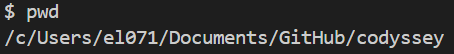
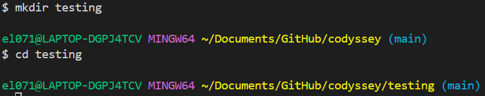
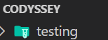
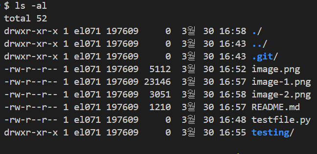

### 0. 전체 미션 개요

```
1단계: 터미널 기본 조작 + 권한 실습
2단계: Docker 설치/점검 
3단계: 컨테이너 실행 실습
4단계: Dockerfile로 커스텀 이미지 제작
5단계: 포트 매핑 + 바인드 마운트 + 볼륨
6단계: Git 설정 + GitHub 연동
7단계: README.md 정리 후 제출
```

- 실행 환경
    - 깃 버전 : git version 2.51.0.windows.1
    - 도커 버전 : Docker version 28.5.2, build ecc6942
    - 터미널 : git bash

### 1. 터미널 조작 및 권한 실습

-  현재 위치 확인 
    - pwd
    
    

- 디렉토리 생성 및 이동
    - mkdir testing
    - cd testing
    - 디렉터리 이동 및 폴더 생성 완료
    
    


- 숨김 파일 포함 목록 확인
    - ls -al
    - 파일 숨김파일 및 권한 확인
    


- 파일 생성 및 내용 확인
    - touch test.txt (txt 파일 생성)
    - echo "testing" > test.txt
    - cat test.txt (상위 문장 출력)
    
    

- 파일 복사
    - cp test.txt test_copy.txt (앞 내용을 뒤에 복사)
    


- 파일 이름 변경 (이동)
    - mv test_copy.txt test_renamed.txt
    


- 파일 삭제
    - rm test_renamed.txt
    - 해당 파일 삭제될 것 (remove)

- 디렉토리 삭제
    - rm testing
        - 단순 디렉터리 삭제
    - rm -r testing
        - 만약 dir 내부에 추가 내용이 있다면 삭제 안됨
        - -r 즉 재귀 옵션을 통해 내부 내용과 함께 제거 가능
        - testing dir에 내용 없음으로 단순 rm 사용
        
        - testing 폴더 제거됨


