### 0. 전체 미션 개요

```
1단계: 터미널 기본 조작 + 권한 실습
2단계: Docker 설치/점검 
3단계: 컨테이너 실행 실습
4단계: Dockerfile로 커스텀 이미지 제작
5단계: 포트 매핑 + 바인드 마운트 + 볼륨
6단계: Git 설정 + GitHub 연동
7단계: README.md 정리 후 제출
```

- 실행 환경
    - 깃 버전 : git version 2.53.0
    - 도커 버전 : Docker version 28.5.2, build ecc6942
    - 터미널 : git bash

### 1. 터미널 조작 및 권한 실습

-  현재 위치 확인 
    - pwd
    
    

- 디렉토리 생성 및 이동
    - mkdir testing
    - cd testing
    - 디렉터리 이동 및 폴더 생성 완료
    
    


- 숨김 파일 포함 목록 확인
    - ls -al
    - 파일 숨김파일 및 권한 확인
    


- 파일 생성 및 내용 확인
    - touch test.txt (txt 파일 생성)
    - echo "testing" > test.txt
    - cat test.txt (상위 문장 출력)
    - 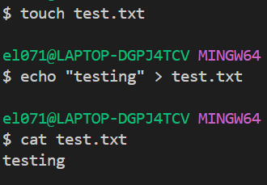
    - 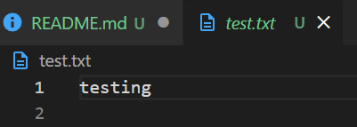

- 파일 복사
    - cp test.txt test_copy.txt (앞 내용을 뒤에 복사)
- 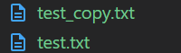


- 파일 이름 변경 (이동)
    - mv test_copy.txt test_renamed.txt
- 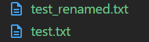


- 파일 삭제
    - rm test_renamed.txt
    - 해당 파일 삭제될 것 (remove)

- 디렉토리 삭제
    - rm testing
        - 단순 디렉터리 삭제
    - rm -r testing
        - 만약 dir 내부에 추가 내용이 있다면 삭제 안됨
        - -r 즉 재귀 옵션을 통해 내부 내용과 함께 제거 가능
        - testing dir에 내용 없음으로 단순 rm 사용
        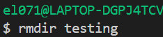
        - testing 폴더 제거됨


### 2. 파일 경로 및 권한 변경 실습

- 현재 test.txt 파일 위치
    - /Users/candystella8115467/Documents/codyssey/E1-1/test.txt
    - 파일 내용을 확인하기 위해 전체 경로를 입력하는 것이 절대 경로 방식
        - ex) cat /Users/candystella8115467/Documents/codyssey/E1-1/test.txt
    - 현재 폴더를 기준으로 상위 dir로 이동함을 의미하는 . 기호 사용하여 전체 경로 입력 생략 방식 (상대 경로)
        - ex ) cat ./test.txt
    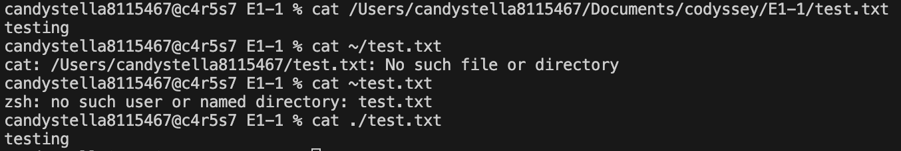


- 특정 파일 권한 확인 및 변경 (chmod)
    - ls -al 명령으로 파일 권한 확인
        - 총 9개 문자를 3개씩 끊는 기준으로 owner, group, other의 권한
        - access(x) write(w) read(r) 순서로 1, 2 ,4 값을 가짐
        - 따라서 모두 모두에게 모든 권한이 열린 경우 777이다
        - 권한 변경은 chmod (권한 숫자) (변경 파일) 순서로 구성
        - 파일 및 디렉토리 권한 변경
    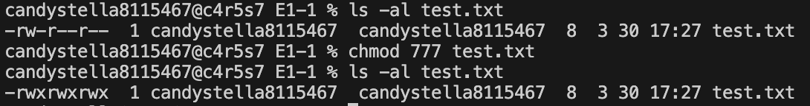
    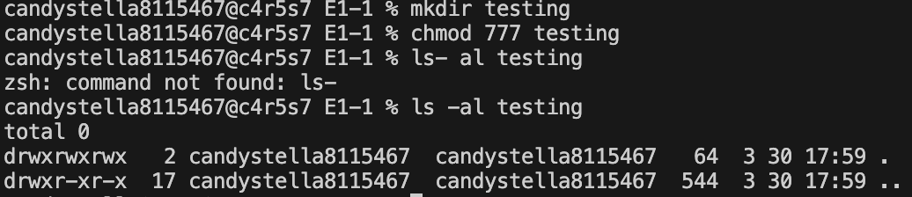

-----
### 3. Docker 설치 및 기본 점검
- docker --version. docker info 출력 결과
- 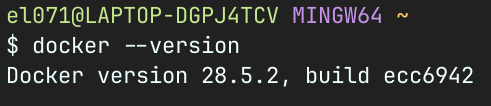
- 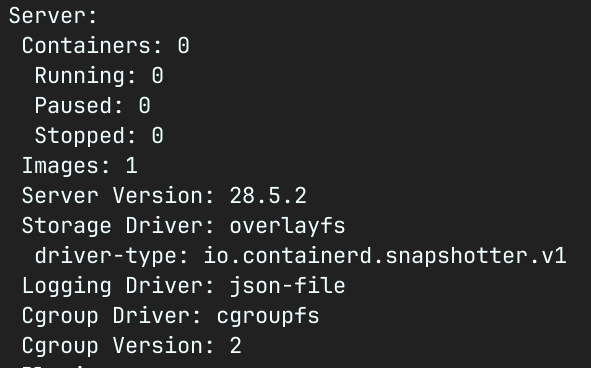


### 4. docker 기본 운영 명령 수행 

- docker 이미지 목록 확인 (docker images)
    - 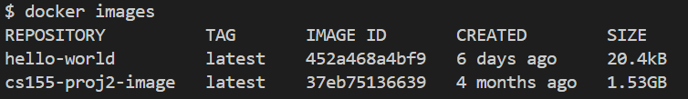
- 컨테이너 실행 중지 목록 확인
    - 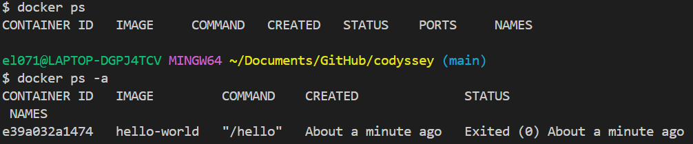
    - docker ps는 현재 실행중인 컨테이너 목록 확인
    - docker ps -a는 종료, 생성 등을 포함한 모든 컨테이너 확인
    - hello-world 이미지가 출력 후 종료되었기에 ps -a에서 확인됨
- 운영 로그 확인 (docker stats)
    - 현재 실행중인 컨테이너 없으므로 아무것도 출력되지 않음


### 5. 컨테이너 실행 실습
- hello-world 이미지 실행 성공
    - 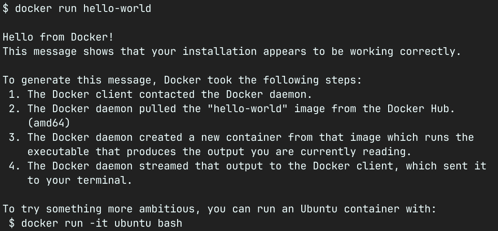

- ubuntu 컨테이너 실행 및 명령 수행
- docker run -it ubuntu bash 사용
- 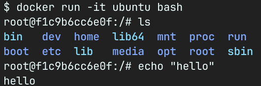
    - docker run: 새로운 컨테이너를 생성 후 실행하기 명령.

    - it: 두 개의 옵션(-i와 -t)이 합쳐진 형태, 터미널에 키보드로 입력을 받는다.
        - i (interactive): 사용자가 키보드로 명령을 입력할 것.
        - t (tty): 가상 터미널(TTY)을 할당
        - d : 추가적으로 d 옵션은 background 실행을 의미함

    -  ubuntu: 실행할 도커 이미지의 이름. local에 없다면 docker hub에서 받아온다.

    - bash: 컨테이너가 실행된 후 가장 먼저 실행할 프로그램.(기본 쉘)


### 5-1 attach와 exec의 차이
- attach
    - 메인 프로세스 (pid 1)에 컨테이너를 직접 연결
    - 해당 컨테이너에서 exit 시 해당 프로세스 종료 
    - 즉 해당 컨테이너 자체가 종료됨
- exec
    - 컨테이너는 타 프로세스에 연결
    - 단 user는 새로운 프로세스에서 컨테이너에 연결한다.
    - 즉 exit 되더라도 user가 접속한 프로세스만 종료 
    - 컨테이너의 프로세스 자체는 연결되어 있는 특징을 가진다.


### 6. dockerfile 기반 커스텀 이미지 제작
- mkdir my-web-project
- cd my-web-project
    - 웹서비스 dir 구성 및 해당 dir로 이동
- echo "< h1>Hello, OrbStack & Docker! This is my custom image.</h1>" > index.html
- 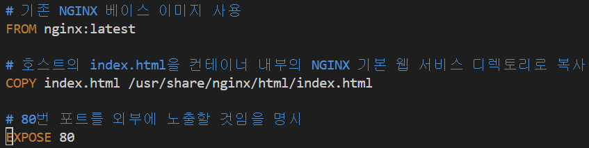
    - index.html 파일에 html 작성
    - 단순 제목만 구성한 정적 형태임
- vi DockerFile
    - vi 에디터 통해 dockerfile 제작
    - FROM nginx:latest
        - nginx 웹서버 최신 버전 이미지를 가져옴 의미
    - COPY index.html /usr/share/nginx/html/index.html
        - 현재 폴더 index.html을 컨테이너 내부 위치로 복붙한다.
    - EXPOSE 80 
        - 80번 포트를 열어서 외부와 통신할 것 의미

----
- docker build -t my-custom-nginx .
- 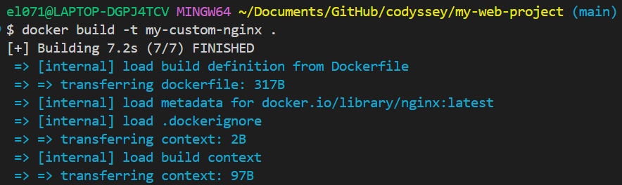
- 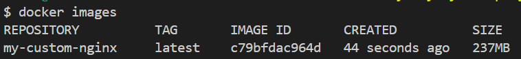
    - 커스텀 이미지 빌드하기 명령
    - my-custom-nginx라는 이름으로 빌드
    - . 명령으로 현재 dir에 있는 Dockerfile 기반으로 빌드할 것

- 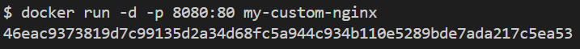
- docker run -d -p 8080:80 my-custom-nginx
    - -d : 백그라운드에서 해당 컨테이너 실행
    - -p : 포트 명시, 로컬 8080 포트로 접속 시 컨테이너 내부 80 포트로 들어감 의미
    - 실행할 이미지는 커스텀으로 구성한 my-custom-nginx
- 이후 localhost:8080 접속 시 커스텀 웹서비스 동작 완료됨
-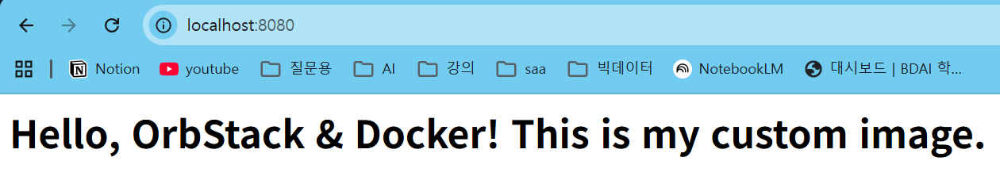


### 7. docker 볼륨 영속성 검증 (가설제시 및 검증)
- docker volume create my-web-data
    - 도커 볼륨 생성
    - 이후 해당 볼륨과 함께 컨테이너 실행
    - 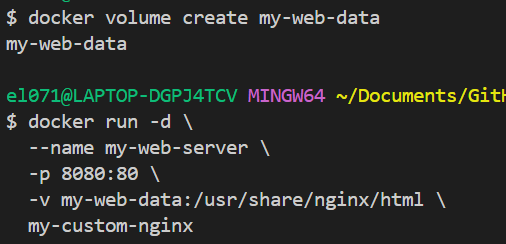
    - 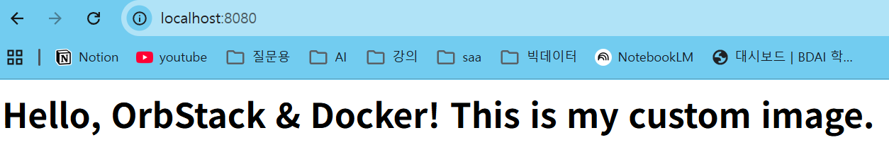
    - 웹서비스 정상 동작 확인됨

- docker exec my-web-server bash -c 'echo "This data will survive!" > /usr/share/nginx/html/test.txt'
    - 컨테이너 내부에 새 파일 생성
    - localhost:8080/test.txt 접근 시 해당 파일 확인 가능
    - 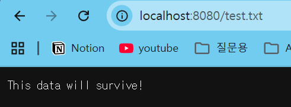

- docker rm -f my-web-server
    - rm -f 명령으로 실행중인 컨테이너 강제 종료 및 삭제

```
docker run -d \
  --name new-web-server \
  -p 8081:80 \
  -v my-web-data:/usr/share/nginx/html \
  nginx:latest
  ``` 
- 이후 8081 포트롤 재연결해 영속성 유지 여부 확인
- 실제로 test.txt 파일 정보는 볼륨에 남아있음을 확인했습니다.
- 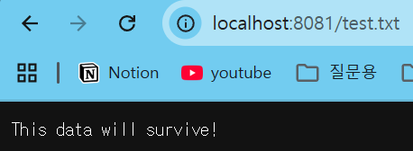


----
### 검증 : 영속성 유지 없이 삭제할 경우
- docker run -d -p 8080:80 --name simple-web my-custom-nginx
    - 단순 해당 명령으로 컨테이너 실행 후 강제 제거시 
    - 볼륨이 없기 때문에 파일이 유지되지 않음

### 8. github 연동 및 로그인
- 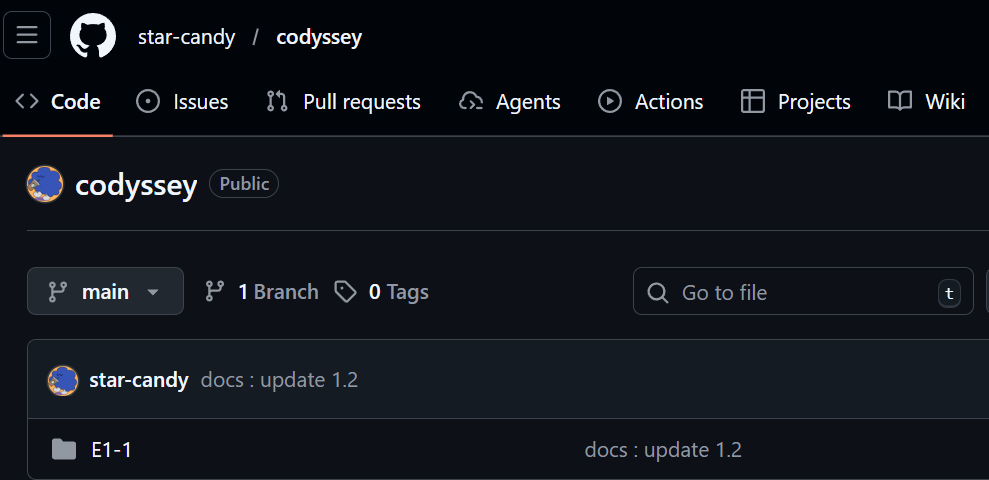
- 코디세이 연동 리포지토리 생성
- 현재 dir에 clone하기
    - git clone https://github.com/star-candy/codyssey.git

- 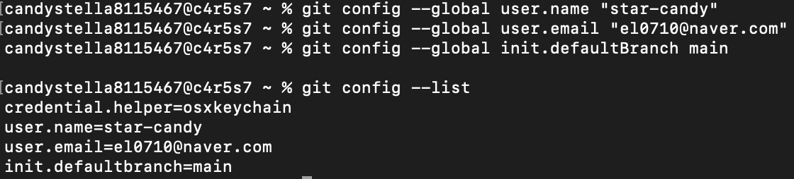
    - user이름 및 이메일 설정 완료
- 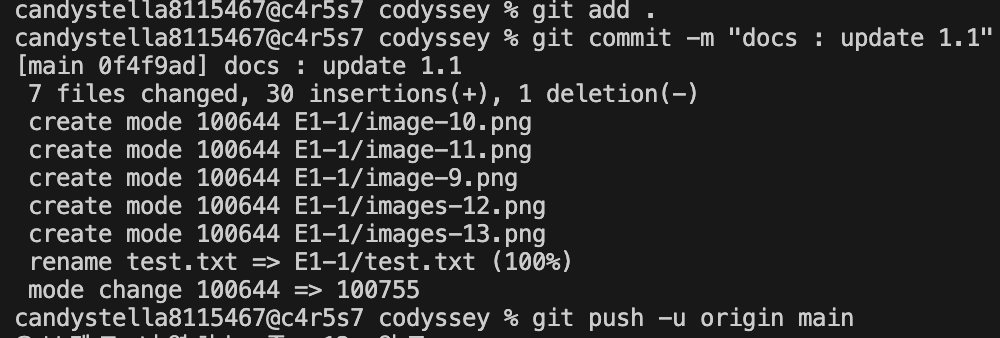
    - git add .로 모든 변경 요소 스테이징 영역으로 이동.
    - git commit으로 스테이징 요소들 커밋
        -m 옵션으로 터미널 상에서 메시지 지정 가능
    - git push로 commit 목록 원격 리포지토리에 반영

